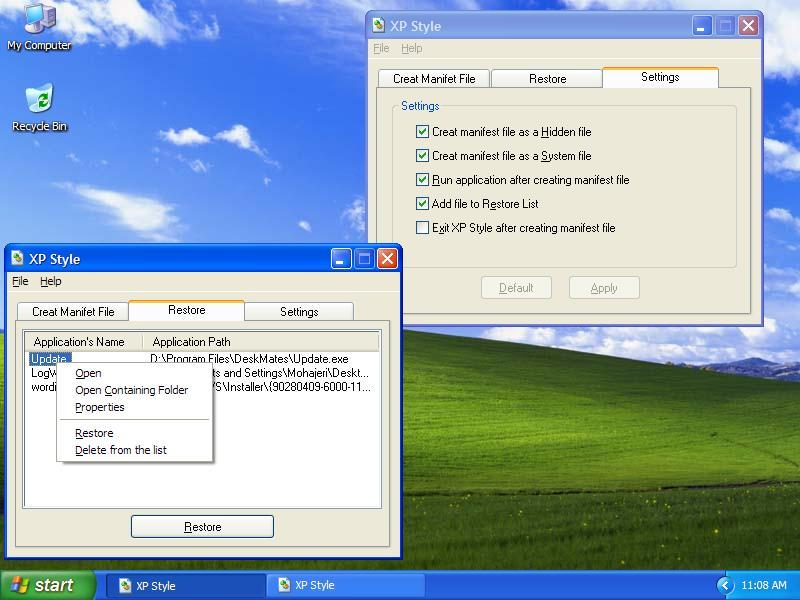



## XP\-Style

### Description

This Application is a manifest maker. It allows you to use Windows XP visual style on your application after you have created them (Windows XP buttons, checkboxes, Option Buttons and etc) and adds your program to registry to use compatibility mode of windows 2000 in order to use XP style with no problem. The restore function is available so you can restore the applications to their original style. It also creates and deletes manifest file for itself so that you can't find the manifest file. Make the EXE file yourself cause if you don't an error will come up! Also I have updated it
 
### More Info
 

             |
---                |---
**Submitted On**   |2003-08-04 22:52:34
**By**             |[Hom](https://github.com/Planet-Source-Code/PSCIndex/blob/master/ByAuthor/hom.md)
**Level**          |Intermediate
**User Rating**    |5.0 (20 globes from 4 users)
**Compatibility**  |VB 6\.0
**Category**       |[Complete Applications](https://github.com/Planet-Source-Code/PSCIndex/blob/master/ByCategory/complete-applications__1-27.md)
**World**          |[Visual Basic](https://github.com/Planet-Source-Code/PSCIndex/blob/master/ByWorld/visual-basic.md)
**Archive File**   |[XP\-Style162424852003\.zip](https://github.com/Planet-Source-Code/hom-xp-style__1-46652/archive/master.zip)

